# Using Qualtrics Web Service to Implement Complex Study Designs

<p align="center">
  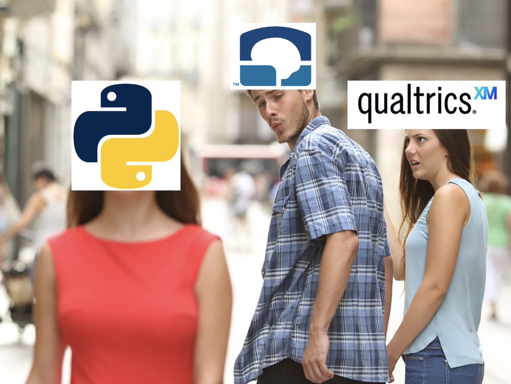
</p>

###### Have you ever needed to make a Qualtrics survey that had several randomized variables, variables that depended on each other, or a complicated display order? And then when you tried to implement it, you realized you'd need to make 1,000 loop and merge rows or if-then branches in survey flow? If so, I'm here to show you that there's a better and easier way to do this!

###### In this tutorial, I’ll show you how to use the Qualtrics Web Service—a feature in the survey flow that lets you move complex survey logic/functionality out of Qualtrics and handle it within a Python application instead. This will be a step-by-step guide on how to make a simple Python app, tailored to your study's needs, and integrate it into a Qualtrics survey. 

###### If you have any questions about this tutorial or how it can be applied to your project, please email me at breanna.nguyen@duke.edu :)

## Problem: In-house Qualtrics survey builder functions sometimes fall short

Consider a psych experiment about evaluating reasons for supporting or opposing statements related to food. How do people evaluate reasons for stances they agree vs disagree with, and does this depend on their food-loving status? The goal of the survey would be to 1) record whether the participant agreed or disagreed with the statements and 2) show them reasons that *other* people gave for agreeing or disagreeing with those statements (collected from a different study). 

Let's think through how that would normally work in Qualtrics.

This would be the first question, since we need to know what the participant's stance is on each statement.

<p align="center">
  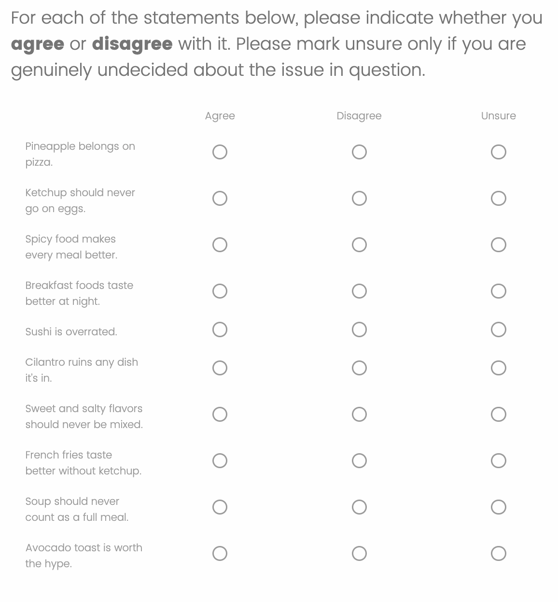
</p>

Here's where it get's complicated. I want the next questions to be about a random subset of the statements, and for each selected statement, we will show a randomly selected subset of reasons. I already have the reasons given by other people, so it should be easy, right? ... right?

I created this example of what I want to show for the next questions. I want to show 5 topics and 4 reasons for each topic. In the end, participants will see 20 of these questions.

<p align="center">
  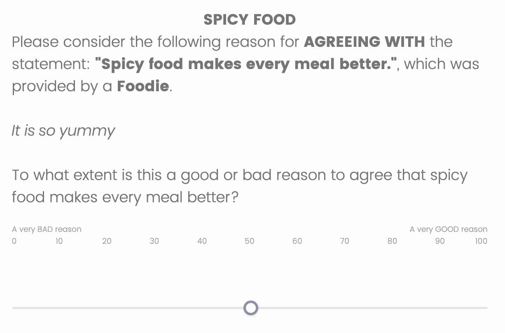
</p>

How many things are going to be varying across questions?
1) The title
2) The agreement value (whether the reason was for agreeing or disagreeing with the statement)
3) The statement itself
4) The reason-giver's food-loving status
5) The reason
6) The agreement value again (but in the question)
7) The statement again (but in the question)

It's even more complicated than just randomizing these variables, since 1, 3, and 7 have to match, 2 and 6 have to match, and 4 and 5 have to correspond to the previously collected reason data. If there are around 10 topics, ~50 reasons for each position, and 2 possible food-loving statuses (Foodie or Non-Foodie) and 2 agreement values (Agree or Disagree), there's thousands of possible combinations for each question! Also, we need to keep in mind that these questions all depend on what stance the participant took in the previous question.

<p align="center">
  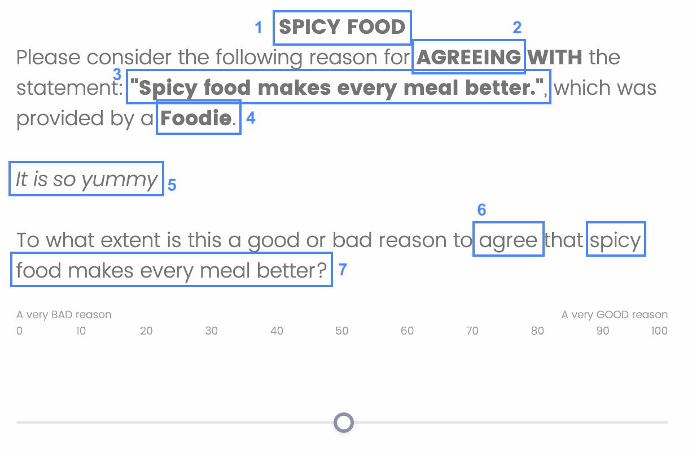
</p>
This usually handled in with loop and merge, embedded data randomization, or display logic. But who wants to think through these 1000s of combinations and manually enter them? Not me.

## Solution: Handle randomization in a Python app and connect it back to your survey using Web Service

In a nutshell, web service is way for your survey to communicate with an external web application in real time. It sends data out from Qualtrics responses and receives data back from your web app. Qualtrics survey information will be sent to the web app in the form of URL parameters, and data will be sent back in a JSON format.

<p align="center">
  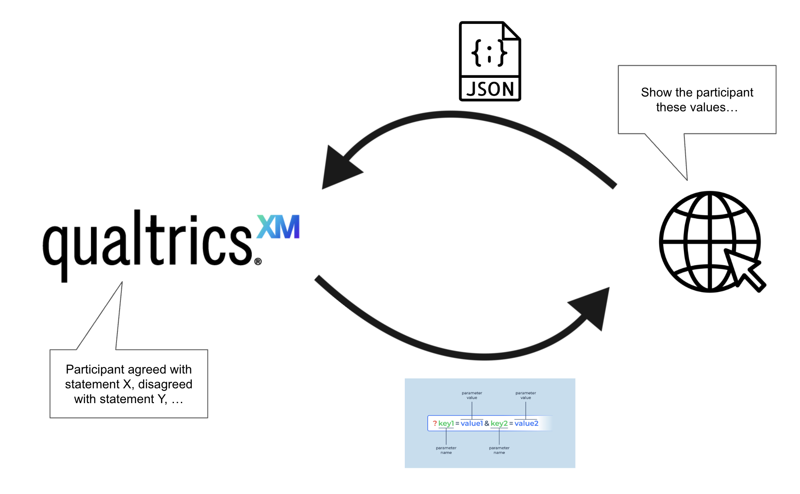
</p>
### Why should you try it?
- Allows you to have far more complex study designs without the hassle of the built-in Qualtrics tools
- Implementation is much faster
- Allows you to easily reproduce studies with small changes
	- Imagine changing a few lines of code rather than 1000 blocks when you want to duplicate your study for different conditions
- Allows us to still use the best of Qualtrics’ features
	- Qualtrics is the industry standard for survey design for a reason: it gracefully handles data collection across hundreds and thousands of people, and it's UI/UX elements are great for psych research purposes

### But wait, how do I even make my own web app? Where do I host it? How does Qualtrics know where to find it and what information to extract from it?

There are an infinite number of ways to make a web app. In this tutorial, I'll be showing you how to implement it with Python and Flask (a web framework for Python) and host it on python anywhere, a *free* hosting platform for Python apps.
<p align="center">
  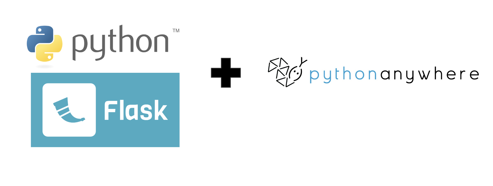
</p>
## Step-by-step guide

### Step 1: Set up beginning of Qualtrics survey as usual

First, we'll need to create a Qualtrics survey and its necessary parts before switching to the web app. For the study I described earlier, I would make this question first, since the future questions depend on the participant's answers to this one. 

<p align="center">
  
</p>
### Step 2: Make one example of the block you want to repeat (so you can take note of the language, format, etc. that should be accounted for).

Now, we need to make an example of what the future questions will look like. This will help us remember what exactly needs to be passed back from the web app. For our example study, it'll be this question.
<p align="center">
  
</p>

Recall the structure of this question and the interdependencies of the variables.

<p align="center">
  
</p>

### Step 3: Set some embedded variables (to be used later)

I mentioned earlier that information from the survey will be passed to the web app using URL parameters. So, we need to set some embedded variables that refer to the answers that the participant gave to the intake questions. **Make sure this embedded variable block comes after the intake questions, otherwise they will be blank.**

<p align="center">
  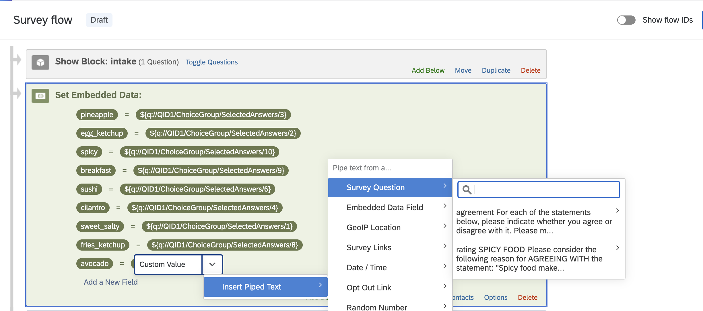
</p>

On the left hand side of the equals sign are the variable names I set for each statement. On the right hand side is the Qualtrics convention for referring to the participant's answer to those questions.

To find them:
1) Click "Set a Value Now" after giving the variable a name
2) A box should appear that is pre-populated with "Custom Value", click the down-arrow nect to it
3) Click "Insert Piped Text"
4) Click "Survey Question"
5) Find the question you want to refer to. If there are multiple sub-questions, find the specific one that the current variable should be set to
	1) Note: You're able to set embedded variables for many things, but what we want here is the participant's answer. Don't set the variable to the description or a recode of the answer. What you're looking for should simply be the question and nothing else.

<p align="center">
  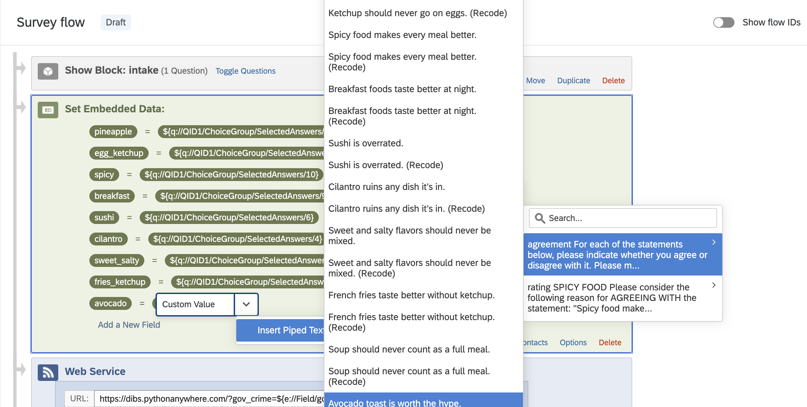
</p>

### Step 4: Make and host your web app

#### Step 4a: Make a pythonanywhere account

Now, we will switch from making the survey to building our custom web app. We need to start by creating an account on https://www.pythonanywhere.com. Whatever your username is, the URL to your website will be {username}.pythonanywhere.com.

**You do NOT need any of the paid features. Follow the steps to make a free account.**
#### Step 4b: Navigate to the Web tab

<p align="center">
  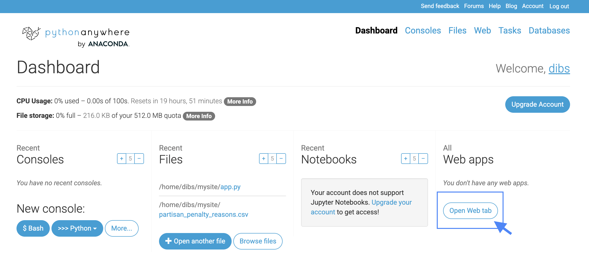
</p>

#### Step 4c: Add a new web app

You'll be asked if you want to upgrade to use a custom domain name. Just click next to continue.

<p align="center">
  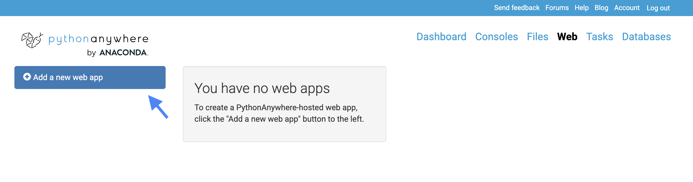
</p>
#### Step 4d: Select Flask

<p align="center">
  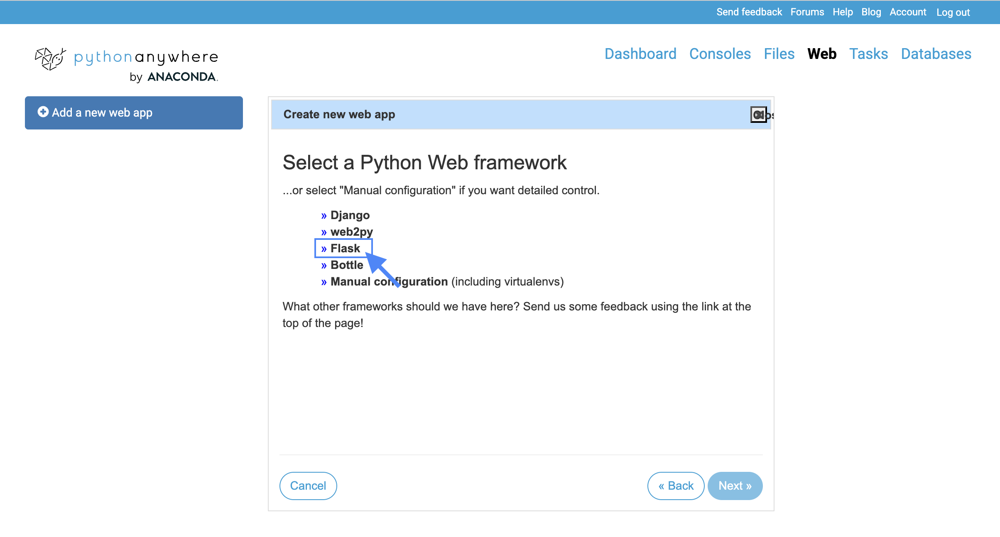
</p>
#### Step 4d: Select a Python version

You can default to the most recent one.

<p align="center">
  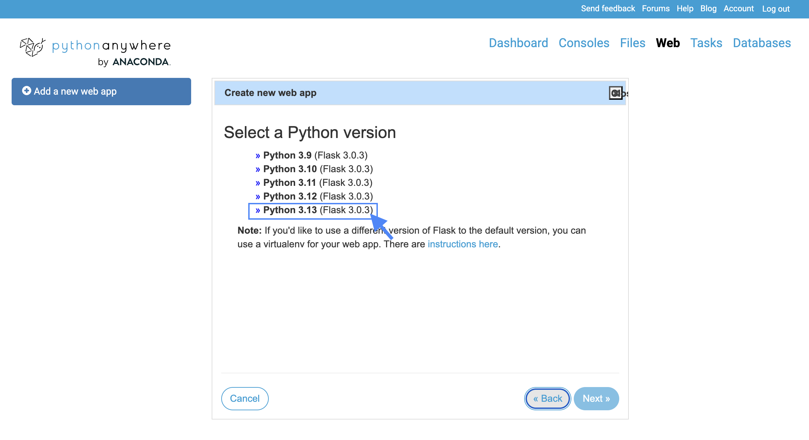
</p>
#### Step 4e: Set your main file

This will already be filled in for you. You can change the file name to whatever you want, but I like it to be app.py. Click next to continue.

<p align="center">
  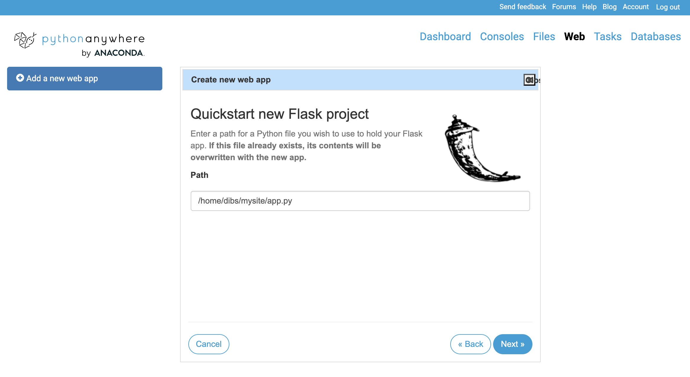
</p>

#### Step 4f: Navigate to the web app file directory

After loading for a bit, you'll be plopped into your web dashboard. This is the home base for your web app. You can navigate to this page at any point by selecting "Web" in the nav bar.

Notice the highlighted URL. That's how your website will be accessed. If you click on it right after creating the web app, it should take you to a page that just says "Hello from Flask!". This is just the default page that pythonanywhere sets.

Also notice the "Best before date:". Because this is a free account, pythonanywhere will disable your site if it notices that you haven't "renewed" it in 3 months. If your project is longer than that, you just have to click the yellow button periodically to push this date back.

<p align="center">
  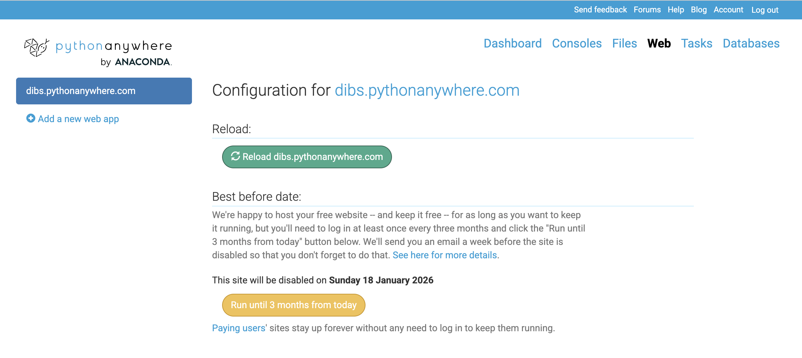
</p>

If you scroll down on this page, you'll find a place to see the access and error logs, how much traffic the site is getting, and other useful things. What we want to do now is find the file directory.

<p align="center">
  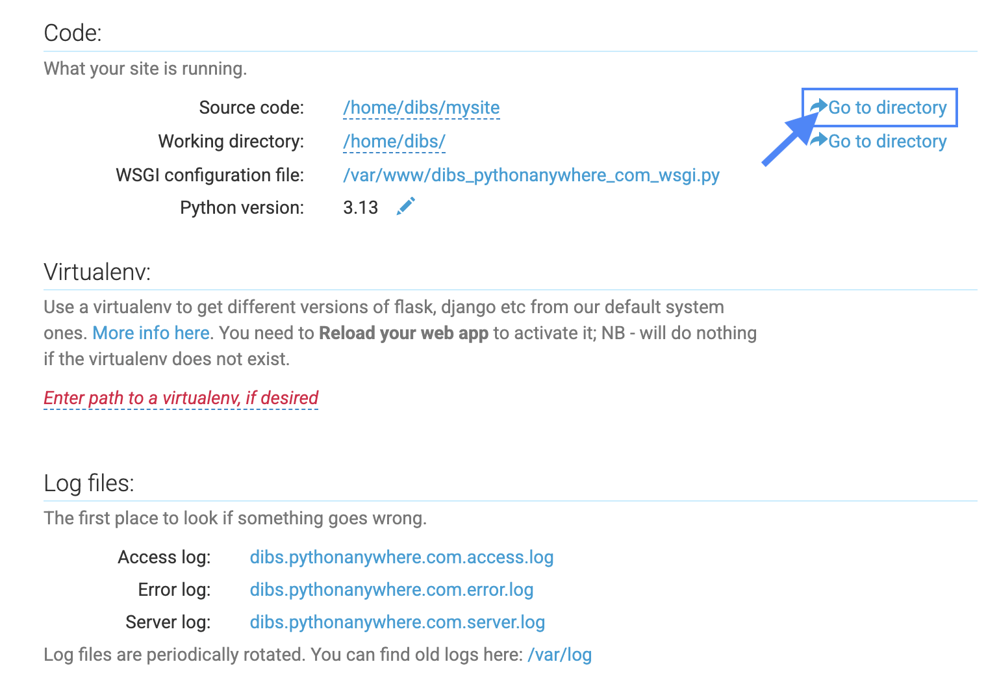
</p>

You'll be taken to this page.

<p align="center">
  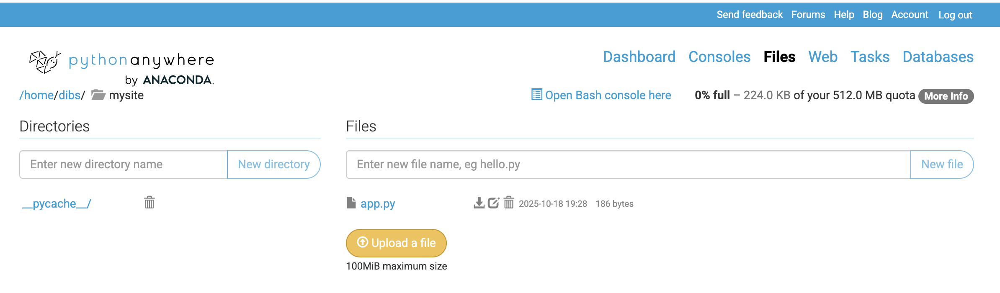
</p>


#### Step 4g: Upload necessary data

Recall that my study design requires reasons that *other* people gave for supporting or opposing food statements. This means that I need an exported and cleaned set of reasons to draw from. You can use the yellow "Upload a file button" to upload datasets like these into your app. I prefer to have them in csv format.

#### Step 4h: Open app.py and do some initial setup

When you open app.py, you should see this:

```python
# A very simple Flask Hello World app for you to get started with...

from flask import Flask

app = Flask(__name__)

@app.route('/')
def hello_world():
    return 'Hello from Flask!'
```

This is what was generating that page we saw when we clicked our link in Step 4f. Now, we should transform this template into what we need for the survey.

First, we need to import the necessary dependencies and initialize some variables that pythonanywhere needs to read our files and run the app.

We can replace everything above `@app.route('/')` with this:

```python
from flask import Flask, request, jsonify
import os.
import random
import pandas as pd

# initialize app stuff
app = Flask(__name__)
app.secret_key = 'w1T4HZqg3mKwgRE712bFS8am0GeOT9Co'
BASE_DIR = os.path.dirname(os.path.abspath(__file__))
```

Flask is the web framework we're implementing, and it comes with some handy functions like `request`, which can extract data from the URL, and `jsonify`, which can turn python data objects into JSON objects.

> I don't have a concrete explanation for the code below that. I just know that these lines are necessary for pythonanywhere to know where your files are and what to run. You can copy and past exactly what I have here, even the secret key (this is a random string I generated).
#### Step 4i: Create the main page of the app

In the example that pythonanywhere gave us for this file, we saw `@app.route('/')`. This line defines what is loaded when the URL is accessed. This usually loads the "homepage" of a website, since there is nothing after the `/`. 

> For example, if we defined an additional page called  with `@app.route('/next_page')`, it could be accessed by going to the URL dibs.pythonanywhere.com/next_page. However, for integration with Qualtrics, other pages don't matter, so we'll just stick with the main page.

Here is how I'm going to set up the main page. Please read the comments to see why I did what I did.

```python

# Recall that I had titles for the questions. I also wanted to store the statments themelves. Here, I created a dictionary of this info that I can refer to later in the code.

TOPIC_INFO = {
    "pineapple": {
        "title": "PINEAPPLE ON PIZZA",
        "statement": "Pineapple belongs on pizza."
    },
    "egg_ketchup": {
        "title": "KETCHUP ON EGGS",
        "statement": "Ketchup should never go on eggs."
    },
    "spicy": {
        "title": "SPICY FOOD",
        "statement": "Spicy food makes every meal better."
    },
    "breakfast": {
        "title": "BREAKFAST FOR DINNER",
        "statement": "Breakfast foods taste better at night."
    },
    "sushi": {
        "title": "SUSHI",
        "statement": "Sushi is overrated."
    },
    "cilantro": {
        "title": "CILANTRO",
        "statement": "Cilantro ruins any dish it’s in."
    },
    "sweet_salty": {
        "title": "SWEET AND SALTY",
        "statement": "Sweet and salty flavors should never be mixed."
    },
    "fries_ketchup": {
        "title": "FRENCH FRIES",
        "statement": "French fries taste better without ketchup."
    },
    "soup": {
        "title": "SOUP AS A MEAL",
        "statement": "Soup should never count as a full meal."
    },
    "avocado": {
        "title": "AVOCADO TOAST",
        "statement": "Avocado toast is worth the hype."
    }
}

@app.route('/')
def index():
# Changed the name to index here because this is a common convention in Flask
    
    # Read in dataframe that I will be pulling the reasons from
    df = pd.read_csv(os.path.join(BASE_DIR, 'food_reasons.csv'))
    
    # Initialize a list of the topics
    # Make sure that these variables names match the ones you made in Qualtrics
    all_topics = [
        "pineapple", "egg_ketchup", "spicy", "breakfast",
        "sushi", "cilantro", "sweet_salty",
        "fries_ketchup", "soup", "avocado"
    ]
    
    # request.arge.get(x) retrieves the information from the x URL parameter
    # This results in a dictionary with values like pineapple: Agree, egg_ketchup: Disagree ... avocado: Agree
    topic_values = {t: request.args.get(t) for t in all_topics}

    # Create a list of the topics for which the participants did NOT say they were unsure (We did not collect reasons for why people were unsure)
    # This loops through all of the keys in the topic_values dict and records it only if the value =/= Unsure
    topics = [
        name for name, value in topic_values.items()
        if value != "Unsure"
    ]

    # Randomly sample 5 of the valid topics
    sampled_topics = random.sample(topics, 5)

    # Initialize a list to later store the "table" data
    table_data = []
    
    # Loop through each topic in the sampled_topics list
    for topic in sampled_topics:

        # Retrieve "info" (title & statement) for the topic we're currently on
        info = TOPIC_INFO[topic]
        
        # Get the agreement value (Agree or Disagree) for the topic we're currently on
        # This value will match what the participant stated in the intake block
        agree_value = topic_values[topic]
        
        # Filter the dataframe for rows that pertain to this specific topic AND are in agreement with the participant
        filtered_df = df[(df["statement"] == topic) & (df["agree"] == agree_value)]
        
        # Randomly sample 4 rows
        sampled_rows = filtered_df.sample(n=4, replace=False)
        
        # Loop through each row to retrieve relevant info
        for j, (_, row) in enumerate(sampled_rows.iterrows(), start = 1):
            
            # Get the title
            title = info["title"]
            
            # Get the wording 
            # This will be AGREEING or DISAGREEING, which is part of the first sentence in the question
            reason_agree1 = agree_value.upper() + "ING"
            
            # Get the statement
            statement = info["statement"]
            
            # Get reason giver's food-loving status from the row
            group = row["food_status"]
            
            # Get reason from the row
            reason = row["reason"]
            
            # Get the wording again
            # This will be agree or disagree, which is used in the last part of the question
            reason_agree2 = agree_value.lower()
            
            # Put the statement in lowercase so it can be part of a question
            question = statement.lower()
            
            # Append all of this data to the 'table'
            table_data.append({
                "topic": topic,
                "title": title,
                "reason_agree1": reason_agree1,
                "statement": statement,
                "reason": reason,
                "group": party,
                "reason_agree2": reason_agree2,
                "question": question
            })

    # VERY IMPORTANT: Return the entire table in JSON format
    return jsonify(table_data) 
```

#### Step 4j: Return to the Web dashboard and reload the app

See the photo in Step 4f. Hit the green reload button to recompile your app using the new code.

Now, if you try to access the URL again, it'll throw an error. Why is that? You can check the error logs (lower down in the dashboard), but I'll explain why: 

We haven't passed any information into the website yet. In the code, we loop through the URL parameters to get the Agree/Disagree values from the participant, but since we're just accessing the URL and passing no extra information, the code doesn't know what to loop through and sample.

### Step 5: Test your web app

Well how do we test the app without having the Qualtrics part set up yet? We pass in dummy data.

Our code is looking for something like `pineapple=Agree&egg_ketchup=Disagree` (and so on) in the URL. All we need to do is write a URL with all the responses hard coded. 

In general, URL parameters are in this format: url.com/?key1=value1&key2=value2 ...

Therefore, this is the URL we should go to in order to test the site: 
dibs.pythonanywhere.com/?pineapple=Agree&egg_ketchup=Agree&spicy=Agree&breakfast=Agree&sushi=Agree&cilantro=Agree&sweet_salty=Agree&fries_ketchup=Agree&soup=Agree&avocado=Agree

Now, if all goes well, accessing this link in your browser will return a wall of text in JSON format. If not, head to the error log to do some troubleshooting.

### Step 6: Return to Qualtrics and connect it all together

Now that we have a functional web app, we need to go back to Qualtrics and connect all the pieces.
#### Step 6a: Add a web service block in the survey flow

**Make sure this is AFTER the embedded variable block and BEFORE the repeated questions block**

<p align="center">
  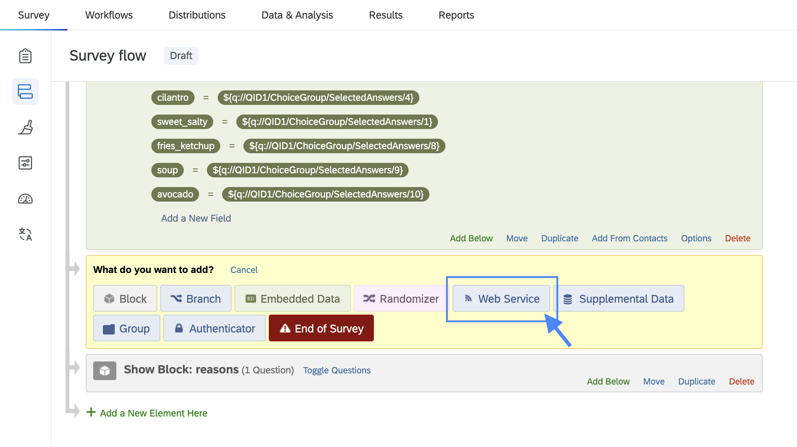
</p>
#### Step 6b: Retrieve website outputs and set as embedded variables
Paste the URL you used to test the website into the box and hit "Test"

> You might be wondering, there are just hardcoded values here, don't we want it to match up with what the participant said in the previous question? The answer is yes, but if we do that before "testing" the website, it'll return nothing (as I explained in 4j). So, these hardcoded variables are still needed for the web service to know what information will be passed back.


<p align="center">
  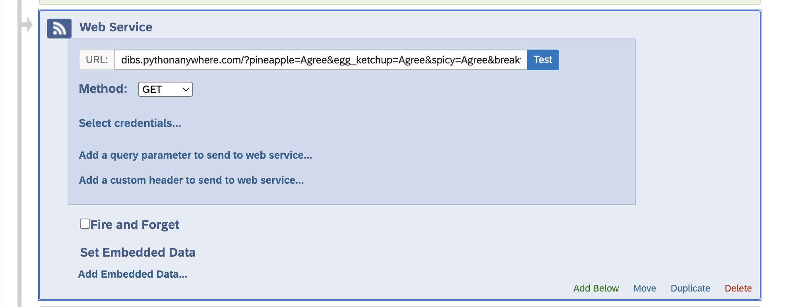
</p>

A window should pop up with all of the returned data. Select "All" at the top of the page and then hit the green "Add Embedded Data" button.
<p align="center">
  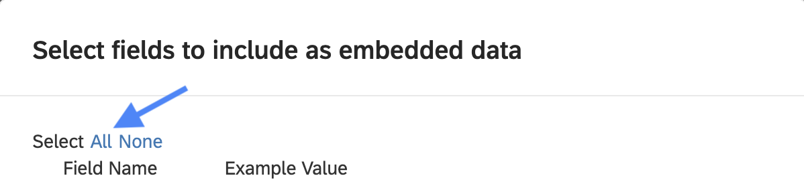
</p>

Now the website variables are set as embedded data. Make sure to save your changes by hitting "Apply" in the bottom right-hand corner.

#### Step 6c: Replace the hard-coded participant responses in the URL with the variable that actually represents their answer

Now we need to replace all the "Agree"s in the URL with participants' actual answers. Luckily, we've already set them as embedded variables prior to the Web Service block. All we need to do is retrieve the variable names for these and populate the URL with this new value. 

I like to find this variable by acting like I'm going to set a new embedded variable, seeing what it's name is, and copying and pasting that over into the URL.

<p align="center">
  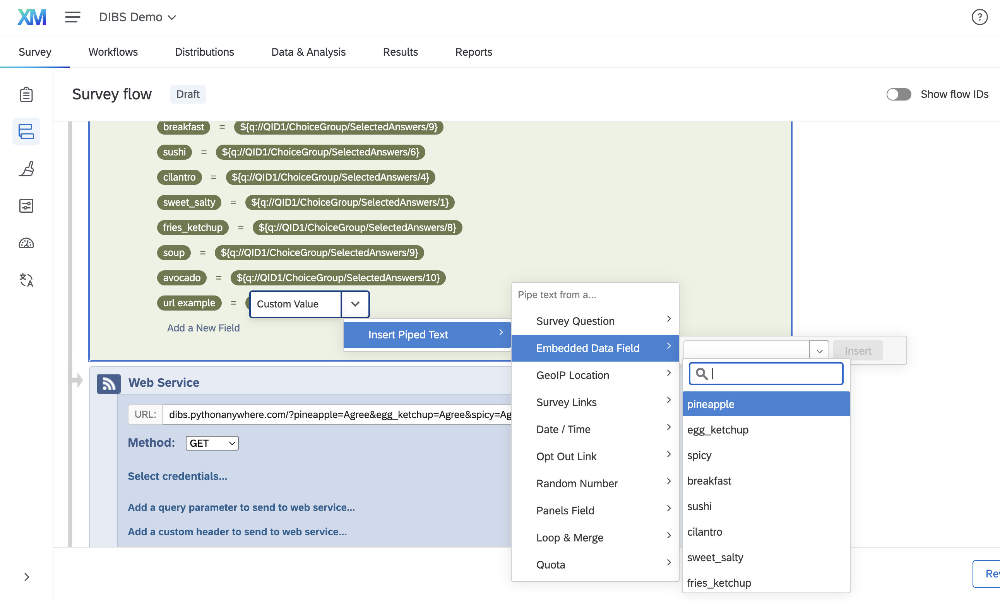
</p>

> You might be wondering, why did we set the embedded variables just to make new variables that refer to those original variables? Well, we didn't *need* to, but it just made it easier to copy and paste all 10 answers. Rather than pasting the longer and non-intuitive variable name for selected answers, we can paste the shorter embedded variable values.

Here, I found that the embedded variable for the pineapple question is `${e://Field/pineapple}`. I can then infer that all of them will be in a similar format `${e://Field/STATEMENT}`. Therefore, the new URL should be: https://dibs.pythonanywhere.com/?pineapple=${e://Field/pineapple}&egg_ketchup=${e://Field/egg_ketchup}&spicy=${e://Field/spicy}&breakfast=${e://Field/breakfast}&sushi=${e://Field/sushi}&cilantro=${e://Field/cilantro}&sweet_salty=${e://Field/sweet_salty}&fries_ketchup=${e://Field/fries_ketchup}&soup=${e://Field/soup}&avocado=${e://Field/avocado}

#### Step 6d: Format and duplicate the repeated questions

Now, we need to go back to the example question we made in Step 2 and replace all the variables that change across questions with the data being sent by the web app.

For example, I would replace the SPICY FOOD title with what the website is passing as the title using Piped Text. You should be able to find the variable you're looking for in the embedded data fields. Based on how I set up the web app and the Web Service, the first title is indexed as `${e://Field/0.title}`. 

<p align="center">
  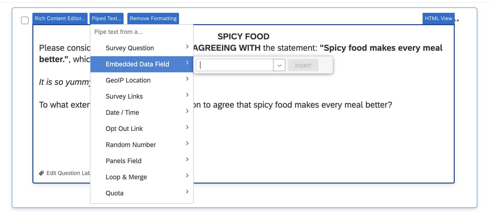
</p>

Now, replace *all* of the variables like that and you should be left with something like this.

<p align="center">
  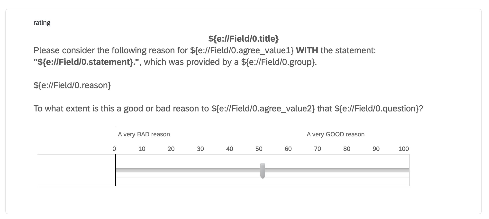
</p>

We've created the first question, but now we need to duplicate this question for each set of information returned by the web app. For this example, we are displaying 20 total reasons, so we need 20 copies of this question.

Notice how the embedded data variables in that first block include `0.` before the actual variable name. This is what will change across those 20 copies. For the next block, the title should be `${e://Field/1.title}`, the next should be `${e://Field/2.title}`, and so on. Since we started at 0, the last block should be `${e://Field/19.title}`. 

>This works with how my app is set up, but if you did it a different way, you'd need to check that the sequence of variables follows this pattern.

**That's it! Now, you should have a working Qualtrics survey with Web Service integration.** 

## Conclusion

I have found that this approach has made survey-building in Qualtrics much easier and more efficient. Before learning this, I would toil over making surveys for hours and hours with some successes and many failures. This approach particularly useful for duplicating studies across conditions. Now, I just have to change a few lines of code rather than giant sets of survey flow elements. This method is fast (the web app takes less than a second to return information) and free, and I hope you will also find it helpful in your work.
